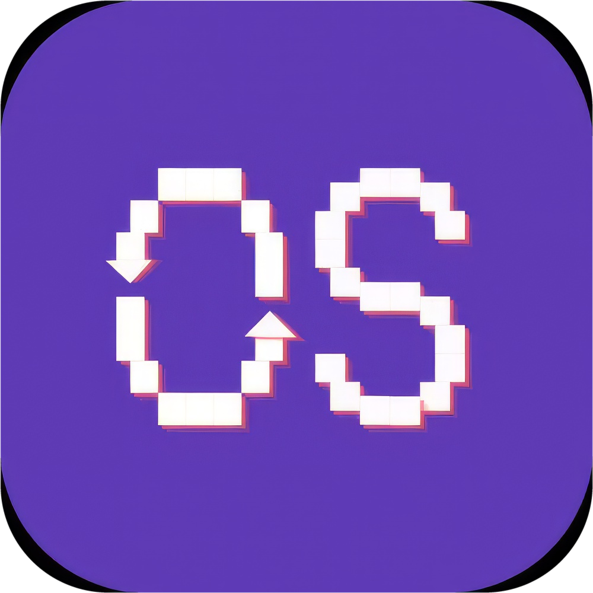
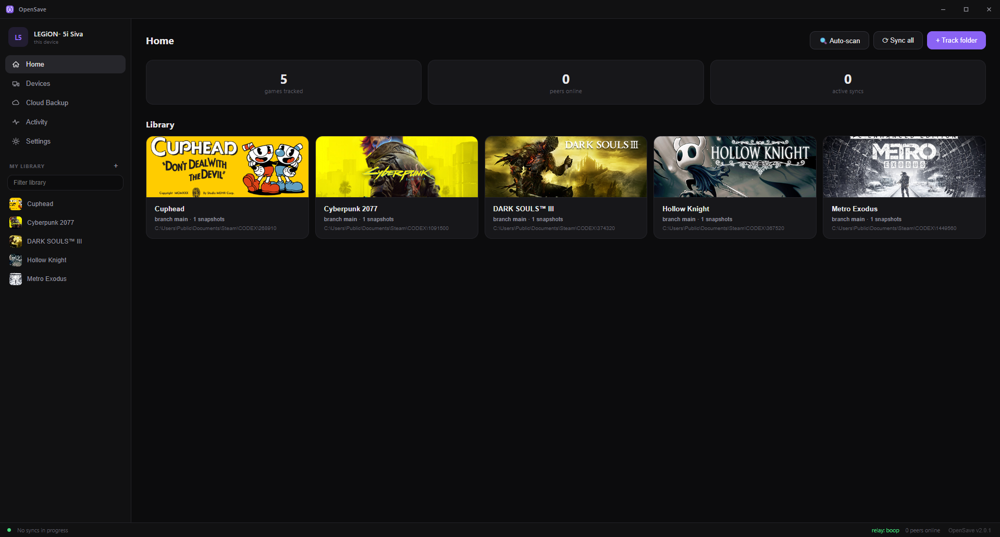
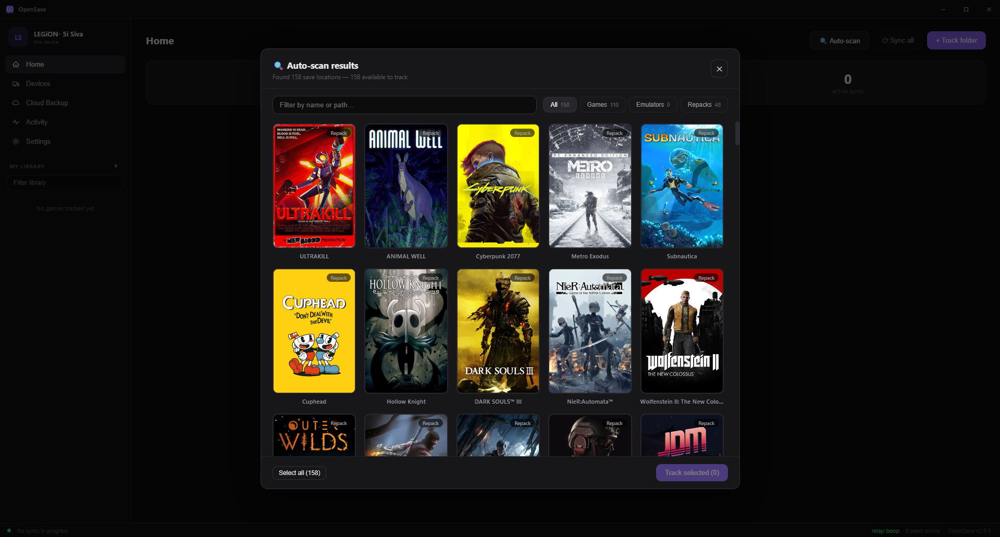
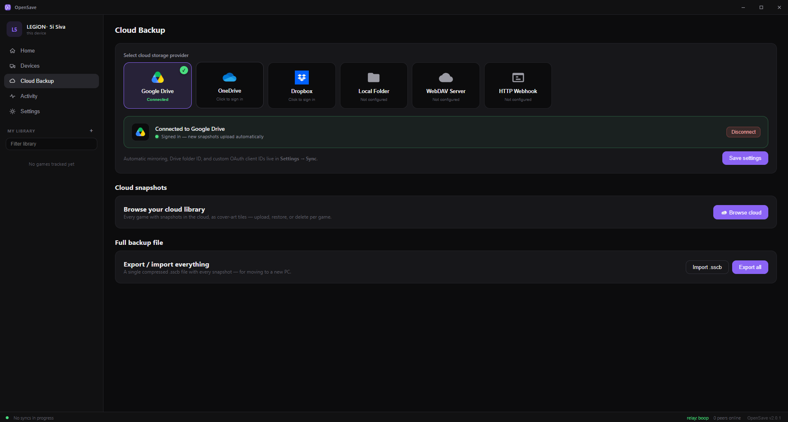
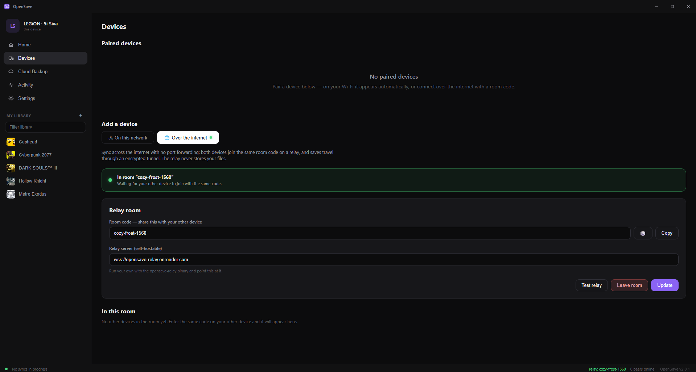

<div align="center">



# OpenSave

### Steam Cloud for every game you own.

**OpenSave** syncs your game saves between devices, peer-to-peer — no Steam required, no accounts, no subscriptions. Point it at a folder, pair your devices, and your saves follow you everywhere.

[](https://github.com/sivadaboi/OpenSave/releases)
[](LICENSE)
[](https://go.dev)


*A complete Go rewrite of the original Node.js/Electron app: one small native binary, no runtime to install, and wire-compatible with existing peers.*

[Install](#install) · [Quick start](#quick-start) · [Screenshots](#screenshots) · [How it works](#how-it-works) · [CLI](#command-line) · [Self-host the relay](#self-hosting-the-relay) · [FAQ](#faq)

<br>



</div>

---

## Why OpenSave

Steam Cloud only covers games bought on Steam — and only when the developer opts in. Everything else (emulators, GOG, Epic, single-player games with no cloud support) is on you: manually copying save folders between your desktop, laptop, and Steam Deck, and hoping you grabbed the newest one.

OpenSave gives **every** game the Steam Cloud experience:

- **You own it.** Saves sync directly between *your* devices. No account to create, nothing stored on someone else's server.
- **It's automatic.** Auto-detects hundreds of games, watches for changes, and syncs the moment a save is written.
- **It's safe.** Every change is snapshotted and reversible. Conflicts are detected and resolved without silently clobbering a playthrough.

## Features

- **Auto-detection** — scans for saves from Steam, emulators (RetroArch, Dolphin, Ryujinx, Yuzu, Citra, PCSX2, RPCS3, PPSSPP, Cemu, Xenia), Steam-emulator repacks (Goldberg, CODEX, RUNE, Tenoke, …), Epic, GOG, Unity `LocalLow`, and Unreal Engine conventions.
- **Track anything** — any folder or single save file, watched live with block-level change detection (SHA-256, 64 KB–2 MB adaptive blocks). Only the blocks that changed are ever transferred.
- **P2P sync** — automatic over LAN (zero-config discovery) or across the internet through a relay **room code** — no port forwarding. A paired-device model means every connection is explicitly approved.
- **Snapshot history** — every change creates a versioned snapshot. Roll back a whole save or a single file; branches keep parallel playthroughs (and conflict resolutions) safe.
- **Smart conflict handling** — diverged saves are detected by **sync lineage**, not wall-clock timestamps. Keep yours, keep theirs, or keep both on a new branch.
- **Cloud backup** — optional mirroring to Google Drive, Dropbox, OneDrive, WebDAV, a webhook, or a local/NAS folder.
- **In-app updates** — one-click update from GitHub releases, or pull a newer build straight from a paired device.
- **Privacy-first** — no accounts, no telemetry. The relay only routes encrypted WebSocket frames and never stores your saves.

## Screenshots

<table>
  <tr>
    <td align="center">
      <br>
      <sub><b>Auto-scan</b> — 158 saves found on this PC, shown as cover art. Games, emulators, and repacks, one click to track.</sub>
    </td>
    <td align="center">
      <br>
      <sub><b>Cloud backup</b> — mirror snapshots to Drive, Dropbox, OneDrive, WebDAV, or a NAS folder. Optional; P2P needs no cloud.</sub>
    </td>
  </tr>
  <tr>
    <td align="center">
      <br>
      <sub><b>Internet sync</b> — pair devices anywhere with a room code. No port forwarding, and the relay never stores saves.</sub>
    </td>
    <td align="center">
      <br>
      <sub><b>Your library</b> — every tracked game with its branch and snapshot history, one Sync all button away.</sub>
    </td>
  </tr>
</table>

## Install

| Platform | Download | Run |
|---|---|---|
| **Windows** | `OpenSave.Setup.exe` (installer) or portable `OpenSave.exe` | Double-click |
| **Linux** | `opensave-linux-amd64.tar.gz` | extract, then `./opensave` |
| **Steam Deck** | Linux build + Decky plugin | see [`opensave-decky-plugin/`](opensave-decky-plugin/) for Game Mode |

Grab the latest from the [**Releases**](https://github.com/sivadaboi/OpenSave/releases) page.

> **Upgrading from the original (JS) OpenSave?** Your data migrates automatically on first launch — tracked games, snapshots, pairings, and cloud settings are imported from `~/.opensave/opensave-db.json` (kept as a backup, never deleted). Go and JS devices can pair and sync with each other during the transition.

## Quick start

1. **Launch OpenSave** on your first device. It scans for installed games and shows detected saves as cover-art tiles.
2. **Track a game** — click a detected tile, or add any folder / save file manually.
3. **Pair a second device.** On the same network, the other device appears automatically under **Devices** — approve the request. Remote? One device creates a **room code** under **Internet Sync**; the other joins with it.
4. **Play.** When a save changes, OpenSave snapshots it and syncs it to every paired device. There's nothing else to do.

Need to undo something? Open a game's **history** and roll back a snapshot — the whole save or a single file.

## How it works

```
   Device A                        Device B
 ┌──────────┐   LAN (auto-discovery)   ┌──────────┐
 │ watcher  │◀───────────────────────▶│ watcher  │
 │ snapshot │                          │ snapshot │
 │  delta   │   WAN via relay room     │  delta   │
 └────┬─────┘   (encrypted frames)     └────┬─────┘
      │            ┌───────────┐            │
      └───────────▶│   relay   │◀───────────┘
                   │ (routes,  │
                   │  no data) │
                   └───────────┘
```

1. **Watch** — a filesystem watcher notices a save was written (safe-write and file-lock aware, so it never grabs a half-flushed file).
2. **Delta** — the save is chunked into content-defined blocks and SHA-256 hashed. A manifest diff finds exactly which blocks changed.
3. **Snapshot** — the new state is recorded as an immutable, versioned snapshot on a branch.
4. **Sync** — only the changed blocks travel to paired peers, over LAN when possible or through a stateless relay room otherwise. Lineage metadata lets the receiver detect a genuine conflict versus a fast-forward.

## Command line

The headless daemon ships with a CLI for servers, scripts, and Steam Deck:

```bash
opensave-cli scan                    # auto-detect installed game saves
opensave-cli add <path>              # track a folder or file
opensave-cli status                  # daemon + sync status for every tracked game
opensave-cli snapshot <game>         # take a manual snapshot
opensave-cli rollback <game> <snap>  # restore a snapshot
opensave-cli branch <game>           # list / create branches
opensave-cli checkout <game> <branch>
opensave-cli remove <game>           # stop tracking
opensave-cli help
```

The daemon exposes a local REST + WebSocket API (P2P on port `8383`) that the desktop UI and CLI both drive, so anything the app can do is scriptable.

## Build from source

```bash
# Desktop app (needs Go 1.26+, Node 18+, and the Wails CLI)
go install github.com/wailsapp/wails/v2/cmd/wails@latest
cd cmd/opensave-app && wails build

# Headless daemon + CLI
go build ./cmd/opensave-cli

# Relay server (self-host)
go build ./cmd/opensave-relay
```

Run the test suite:

```bash
go test ./...          # unit tests
go test ./e2e/...      # end-to-end pairing & sync tests
```

## Self-hosting the relay

The relay is stateless — it brokers room codes and proxies OAuth, but never sees or stores your saves. Run your own for full control:

```bash
./opensave-relay                     # listens on :8386
PORT=10000 ./opensave-relay          # custom port
docker build -f relay/Dockerfile .   # or as a container
```

Point **Settings → Internet Sync → Relay server** at your instance. `opensave-cli upnp 8386` forwards the port on UPnP-capable routers.

## Architecture

```
cmd/opensave-app       Wails desktop app (daemon embedded + Svelte UI)
cmd/opensave-cli       Headless daemon & CLI
cmd/opensave-relay     Stateless WAN relay (room broker + OAuth proxy)
internal/
  store                SQLite persistence + legacy JSON import
  delta                Block hashing, manifest diff, patching
  snapshot             ZIP snapshots, branches, retention
  watcher              Save-change detection (safe-write aware, lock guard)
  p2p                  Discovery, pairing, sync engine, LAN/WAN transports
  cloud                Backup providers + PKCE OAuth
  presets              Game / emulator / store save-location detection
  api                  Local REST + WebSocket dashboard API
  daemon               Long-running service orchestration
  sysintegration       Tray, notifications, autostart
opensave-decky-plugin  Steam Deck Game Mode plugin (Decky Loader)
```

The daemon speaks the same REST/WebSocket API and P2P wire protocol as the original JS app, so old and new versions interoperate during a rollout.

## Data & privacy

Everything lives under `~/.opensave/`:

| Path | What |
|---|---|
| `opensave.db` | SQLite store — tracked games, snapshots, pairings, settings |
| `snapshots/` | Versioned save snapshots |
| `opensave.log` | Activity log for diagnostics |
| `opensave-db.json` | Legacy JS database (kept as an import backup) |

No accounts, no telemetry, no analytics. See [PRIVACY.md](PRIVACY.md) for the full statement.

## FAQ

**Do I need a server or an account?**
No. Devices sync directly. The optional relay only matters for syncing across the internet, and you can self-host it.

**Is my data encrypted in transit?**
Yes — WAN sync travels as encrypted WebSocket frames through the relay, which routes frames without storing them.

**What if two devices change the same save while offline?**
OpenSave detects the divergence by sync lineage and asks you to keep yours, theirs, or both (on a new branch). It never silently overwrites.

**Does it work with non-Steam or emulated games?**
Yes. If it writes a save to disk, OpenSave can track it — Steam, emulators, GOG, Epic, and repacks are auto-detected; anything else you can add by path.

**Can old (JS) and new (Go) versions talk to each other?**
Yes, during the transition. They share the same wire protocol and your data migrates automatically.

## Contributing

Issues and pull requests are welcome. Please run `go test ./...` before opening a PR, and keep changes focused. For larger features, open an issue first so we can align on approach.

## Documentation

- [User Guide](USER_GUIDE.md) — first run, syncing, snapshots, cloud backup, troubleshooting
- [Changelog](CHANGELOG.md) — release notes
- [Privacy](PRIVACY.md) — what OpenSave does and doesn't do with your data

## License

[MIT](LICENSE) — retains the original author's copyright and credits the Go rewrite.
